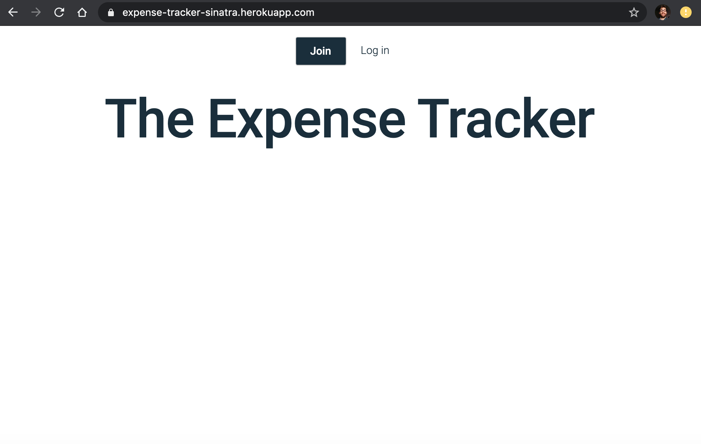
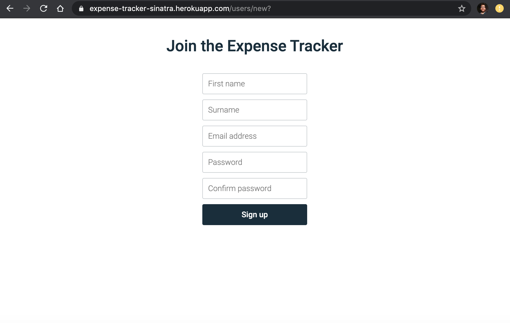
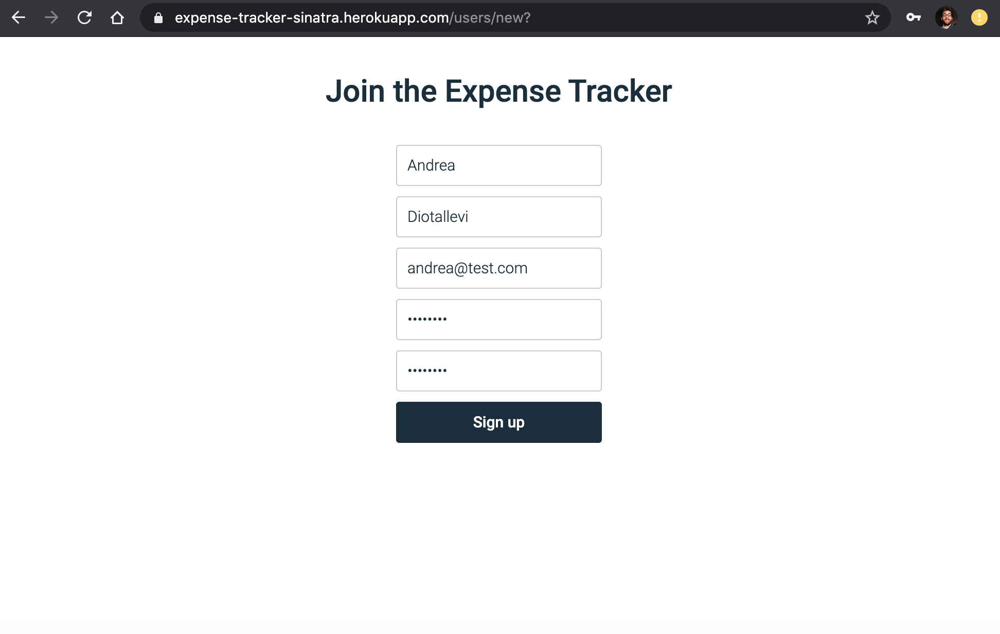
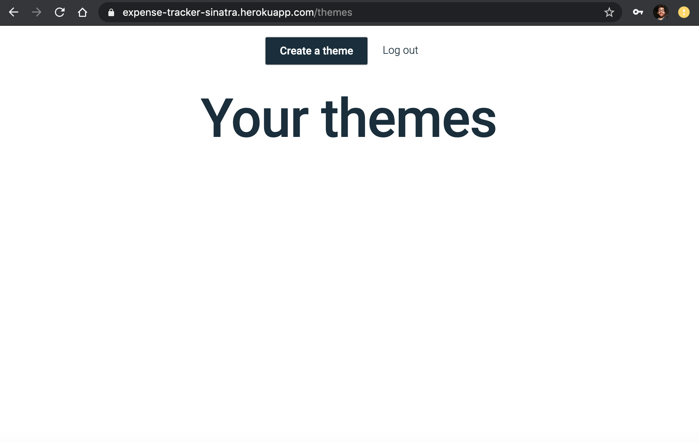
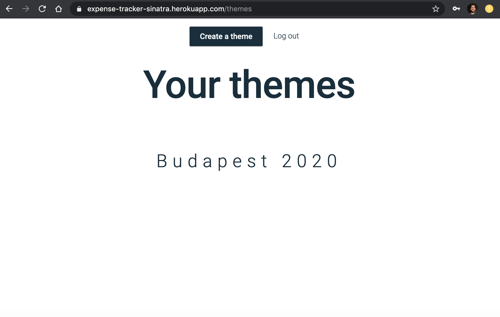
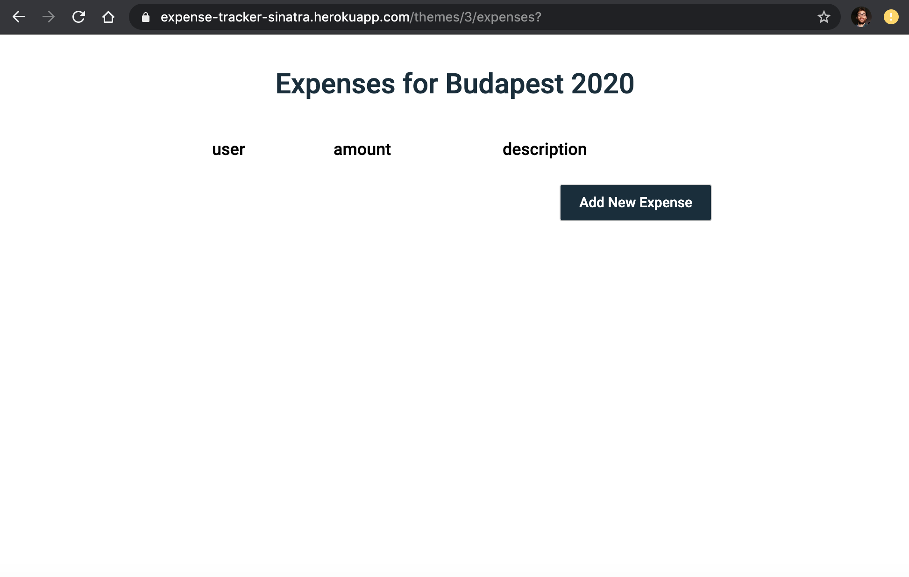
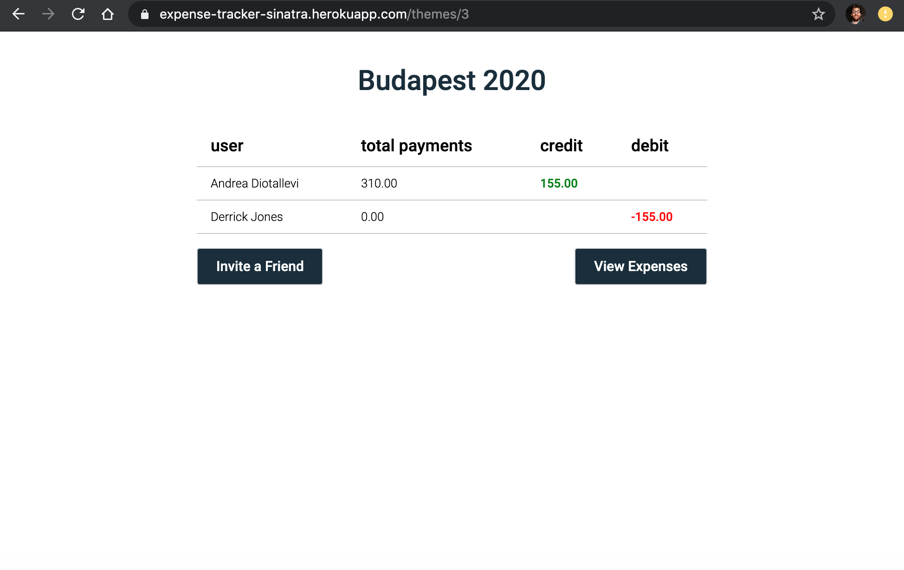
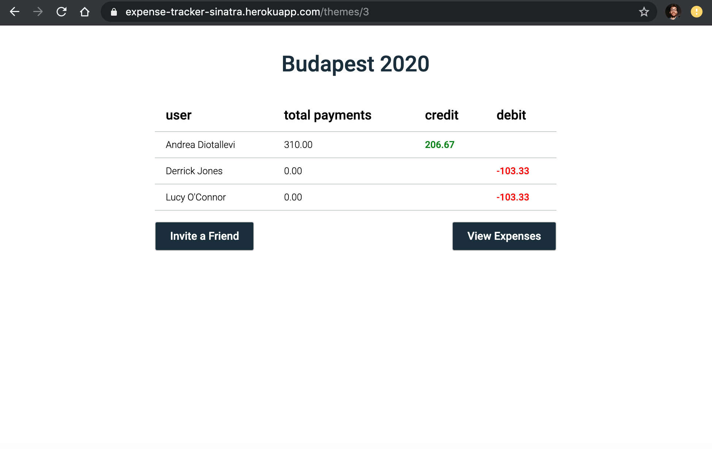
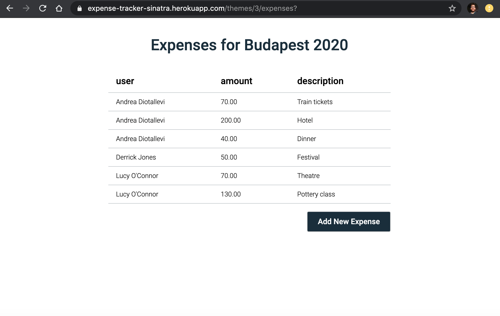
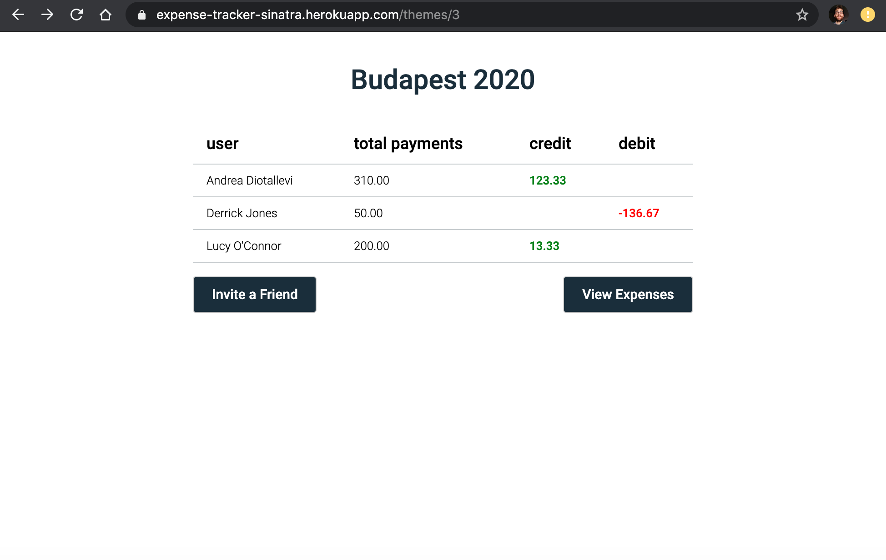

# Expense Tracker

## Description

A full-stack web application in Ruby & Sinatra where you can manage shared expenses and calculate credit and debit balances for each member of a theme.

## Live Demo

The application is deployed to Heroku at this link: [https://expense-tracker-sinatra.herokuapp.com](https://expense-tracker-sinatra.herokuapp.com/)

## Challenges and Goals

* Build a full-stack web application to help people keep track of group holiday expenses and each member credit and debit.
* Build a MVC application following conventional design patterns.
* Design relational database associations and RESTful routes.
* Write SQL-like queries through an Object-Relational Mapping system like Active Record within a MVC application.
* Build a fully-tested application with 100% test coverage.

## Prerequisites

* Clone this repository with ```git clone git@github.com:AndreaDiotallevi/expense-tracker.git```
* Change into the folder with ```cd expense-tracker```
* Install all the dependencies with ```bundle```
* Install postgreSQL with ```brew install postgresql```
* Make sure you restart the server with ```brew services restart postgresql```
* Create the database with ```rake db:create```
* Migrate the database with ```rake db:migrate```
* Migrate the test database with ```rake db:migrate RACK_ENV=test```
* Start the server with ```ruby app.rb```
* Open in the browser ```http://localhost:4567/```
* Stop the server with ```Ctrl-C```

## Technologies Used

- Main technologies:
  - [Ruby](https://www.ruby-lang.org/en/): open source programming language with a focus on simplicity and productivity.
  - [Sinatra](http://sinatrarb.com/): a free and open source software web application library and domain-specific language written in Ruby.
  - [Active Record](https://guides.rubyonrails.org/active_record_basics.html): the M in MVC - the model - which is the layer of the system responsible for representing business data and logic.
  - [BCrypt](https://rubygems.org/gems/bcrypt/versions/3.1.12): a sophisticated and secure hash algorithm designed by The OpenBSD project for hashing passwords.
  - [PG](https://rubygems.org/gems/pg/versions/0.18.4): Ruby interface to the {PostgreSQL RDBMS}.
  - [Rake](https://rubygems.org/gems/rake/versions/11.2.2): tt allows you to use ruby code to define "tasks" that can be run in the command line.
  - [Rubocop](https://rubygems.org/gems/rubocop/versions/0.39.0): automatic Ruby code style checking tool. Aims to enforce the community-driven Ruby Style Guide.
  
- Testing frameworks:
  - [RSpec](https://rspec.info/): testing framework for Ruby.
  - [Capybara](https://rubygems.org/gems/capybara/versions/2.7.1): an integration testing tool for rack based web applications. It simulates how a user would interact with a website.

## How to Run the Tests

To run all the test type ```rspec```

## Code Quality

To run the linter type ```rubocop```

## Relational Database Associations

| Users      | Themes | Participations | Expenses    |
| ---------- | ------ | -------------- | ----------- |
| id         | id     | id             | id          |
| first_name | title  | user_id        | user_id     |
| surname    |        | theme_id       | theme_id    |
| email      |        |                | amount      |
| password   |        |                | description |

## Live Features

* Go to the Expense Tracker homepage [https://expense-tracker-sinatra.herokuapp.com](https://expense-tracker-sinatra.herokuapp.com/):



* Click 'Join' to be redirected to the sign up page:



* Enter your details and click 'Sign up' to be redirected to the themes page:



* This is the themes page when you can view all the themes you are member of:



* Click 'Create a theme' to create a new theme:


* Enter the name of the theme and click 'Create theme':


* Now you can view the new theme you have just created:



* Click on the theme to be redirected to the theme page:


* Click on 'View Expenses' to view all the expenses that have been recorded for this specific theme:



* Click on 'Add New Expense' to add a new expense. In this example we have added three expenses:


* Click on 'Invite a Friend' to invite a friend to participate to this theme.



* Click on 'Invite a Friend' to invite another friend to participate to this theme.



* Now, each both users can log in on their accounts and register their expenses:



* And on the main theme page, you can view the credit and debit balances for each member of a theme:


